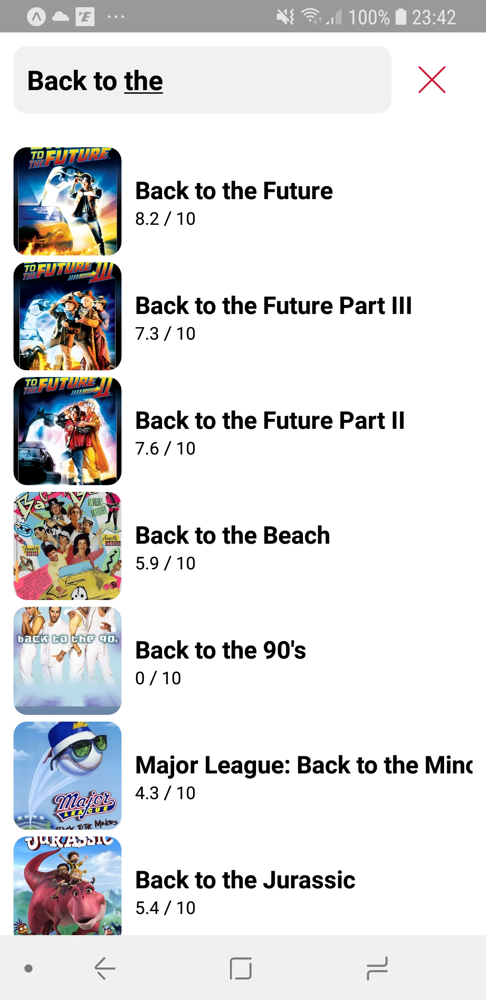

# MoviesAppChallenge

## How to use it ?

- Install EXPO CLI
- Install on your smartphone (Android is preferred) EXPO
- Clone this project on your computer and go to the repository
- Type : npm install
- Type : expo start
- Scan the flashcode with your Expo app.

OR

- Install on your smartphone (Android is preferred) EXPO
- Then go to : https://exp.host/@renadr/MoviesAppChallenge

## Screenshots

